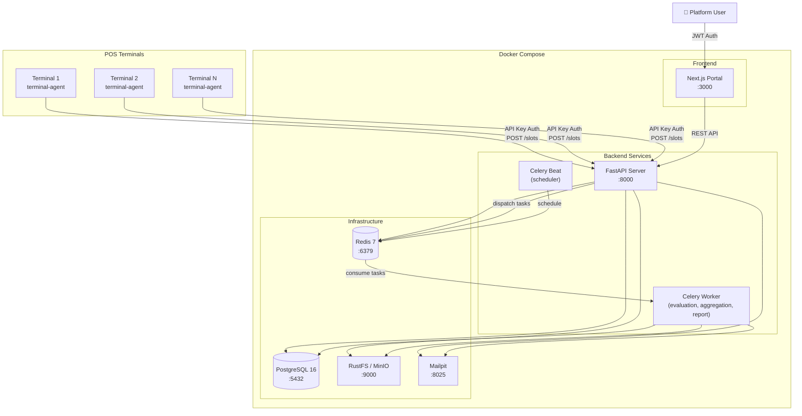
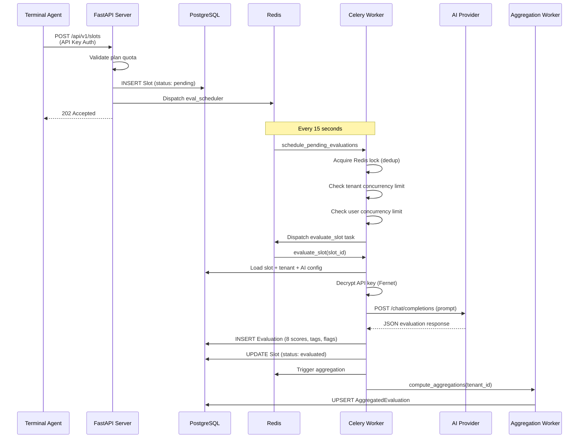
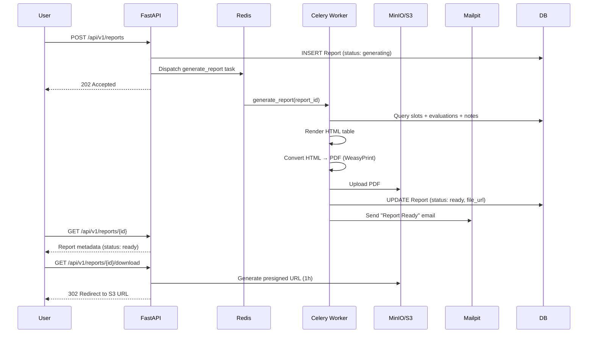
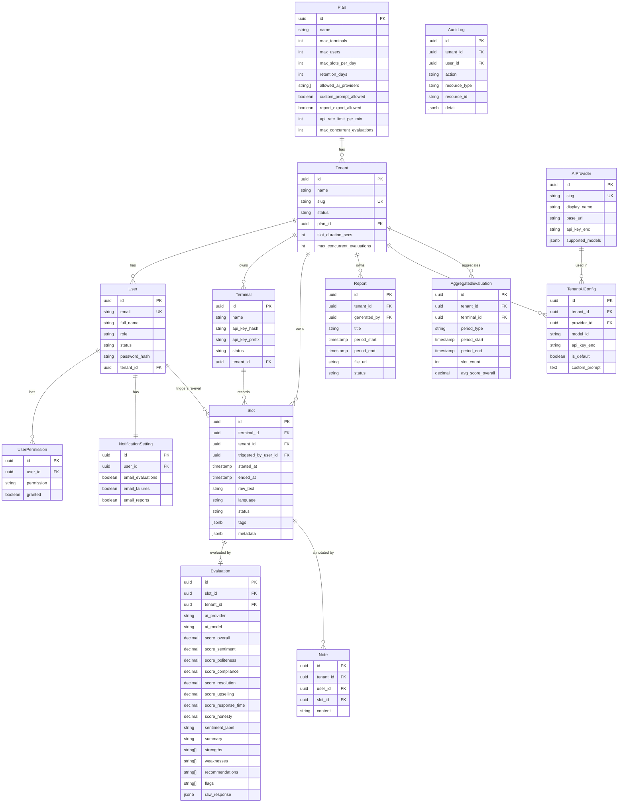
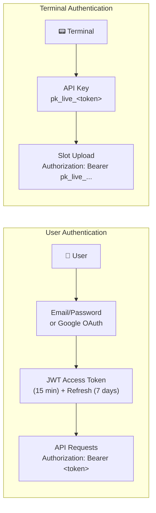
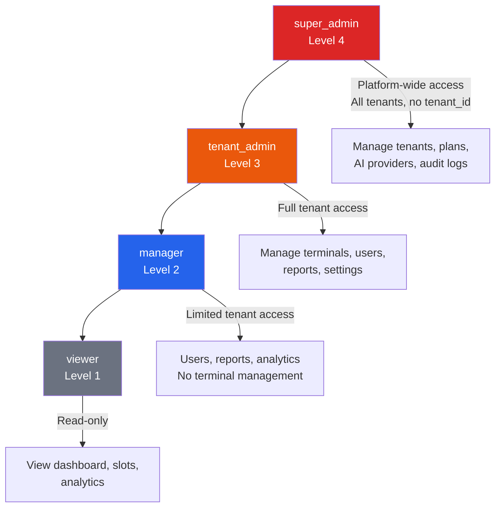
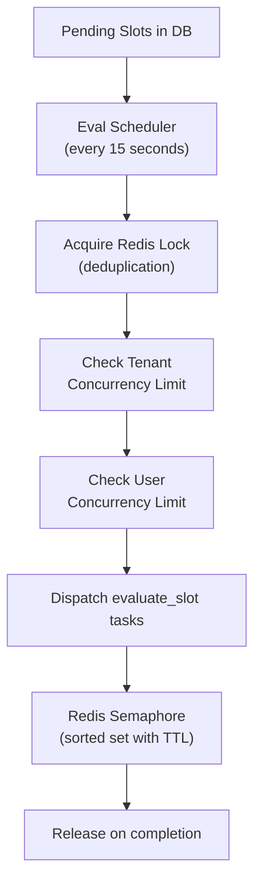

# Mutell — POS Interaction Evaluation Platform

Mutell is a **multi-tenant SaaS platform** for monitoring and evaluating Point-of-Sale (POS) terminal interactions. It captures customer-agent text conversations, runs AI-powered quality evaluations across 8 metrics, and presents actionable insights through a web dashboard.

---

## Table of Contents

- [Architecture Overview](#architecture-overview)
- [System Components](#system-components)
- [Data Flow](#data-flow)
- [Database Schema](#database-schema)
- [Authentication & Authorization](#authentication--authorization)
- [AI Evaluation Engine](#ai-evaluation-engine)
- [API Endpoints](#api-endpoints)
- [Getting Started](#getting-started)
- [Project Structure](#project-structure)

---

## Architecture Overview



---

## System Components

| Component | Technology | Port | Purpose |
|---|---|---|---|
| **Backend API** | FastAPI + SQLAlchemy 2.0 + Alembic | 8000 | REST API, JWT auth, slot management |
| **Celery Worker** | Celery + Redis | — | Async evaluation, aggregation, report generation |
| **Celery Beat** | Celery Beat | — | Periodic task scheduling (every 15s eval, every 15min aggregation) |
| **Portal** | Next.js 16 + React 19 + Tailwind CSS 4 | 3000 | Web dashboard, analytics, admin UI |
| **Terminal Agent** | Python (scaffold) | — | Records POS interactions, uploads to backend |
| **PostgreSQL** | PostgreSQL 16 | 5432 | Primary database (13 models) |
| **Redis** | Redis 7 | 6379 | Celery broker, token blacklist, eval concurrency semaphore |
| **RustFS/MinIO** | S3-compatible storage | 9000 | PDF report storage |
| **Mailpit** | SMTP testing | 8025/1025 | Local email testing |

---

## Data Flow

### Slot Upload & Evaluation Pipeline



### Report Generation Pipeline



---

## Database Schema



---

## Authentication & Authorization

### Dual Authentication System



### Role-Based Access Control



### Key Auth Details

- **Users**: JWT (HS256) — access token (15 min) + refresh token (7 days). On logout, user ID is blacklisted in Redis.
- **Terminals**: API key (`pk_live_<random>`) — prefix stored in DB, full key bcrypt-hashed. Shown once on creation.
- **6 granular permissions**: `export_reports`, `view_analytics`, `manage_terminals`, `manage_users`, `create_notes`, `generate_reports`

---

## AI Evaluation Engine

### Supported Providers

```mermaid
graph LR
    subgraph "Mutell AI Engine"
        PB["Prompt Builder"] --> ADP["Adapter Factory"]
        ADP --> O["OpenAI<br/>gpt-4o, gpt-4o-mini"]
        ADP --> A["Anthropic<br/>claude-sonnet-4"]
        ADP --> G["Gemini<br/>gemini-2.0-flash"]
        ADP --> Z["ZAI (GLM)<br/>glm-4-flash"]
        ADP --> D["DeepSeek<br/>deepseek-chat"]
    end

    subgraph "Configuration Hierarchy"
        PP["Platform Provider<br/>(global API key)"]
        TC["Tenant AI Config<br/>(override key + model + custom prompt)"]
    end

    TC -.->|"overrides"> PP
    PP -.-> ADP
```

### Evaluation Process

Each conversation is scored across **8 metrics** (0–100 scale):

| Metric | Description |
|---|---|
| `score_overall` | Overall interaction quality |
| `score_sentiment` | Customer sentiment analysis |
| `score_politeness` | Agent politeness and courtesy |
| `score_compliance` | Adherence to business rules |
| `score_resolution` | Issue resolution effectiveness |
| `score_upselling` | Upselling attempts and quality |
| `score_response_time` | Response promptness assessment |
| `score_honesty` | Honesty and transparency |

The AI also extracts: **strengths**, **weaknesses**, **recommendations**, **flags**, **unavailable items**, **swearing instances**, **off-topic segments**, and **speaker identification**.

### Concurrency Control



Tenant concurrency limits come from the **Plan** (or per-tenant override). The scheduler re-triggers itself if slots were skipped due to limits.

---

## API Endpoints

| Prefix | Purpose |
|---|---|
| `/api/v1/auth` | Login, register, Google OAuth, refresh, logout, forgot/reset password, accept invite |
| `/api/v1/slots` | Upload (terminal), list, detail, re-evaluate, bulk re-evaluate |
| `/api/v1/evaluations` | Get evaluation by slot_id |
| `/api/v1/aggregations` | Pre-computed score averages (hour/day/week/month) |
| `/api/v1/terminals` | CRUD, ping/heartbeat, regenerate API key |
| `/api/v1/users` | List, invite, update, delete, permissions |
| `/api/v1/tenants` | CRUD for tenant organizations |
| `/api/v1/notes` | CRUD annotations on slots |
| `/api/v1/reports` | Create, download (PDF), list, delete |
| `/api/v1/plans` | Subscription plan management |
| `/api/v1/settings/ai` | AI provider configuration per tenant |
| `/api/v1/settings` | Notification preferences |
| `/api/v1/dashboard` | KPI stats, trends |
| `/api/v1/analytics` | Comprehensive analytics summary |
| `/api/v1/admin` | Super admin: tenants, plans, users, AI providers, audit log, health |

---

## Getting Started

### Prerequisites

- Docker & Docker Compose
- Copy `.env.example` to `.env` and fill in API keys

```bash
cp .env.example .env
# Edit .env — add AI provider keys, Google OAuth credentials, etc.
```

### Launch Everything

```bash
docker compose up --build
```

This starts all services:

| Service | URL |
|---|---|
| Portal (Dashboard) | http://localhost:3000 |
| Backend API | http://localhost:8000 |
| API Docs (Swagger) | http://localhost:8000/docs |
| MinIO Console | http://localhost:9001 |
| Mailpit (Email) | http://localhost:8025 |

### Default Seed Data

On first startup, the system creates:

- **3 Plans**: Starter (3 terminals, 5 users, 500 slots/day), Professional (15/25/5000), Enterprise (100/200/100000)
- **5 AI Providers**: OpenAI, Anthropic, Gemini, ZAI, DeepSeek
- **1 Super Admin**: `admin@platform.com` / `admin123`

---

## Project Structure

```
Mutell-Demo/
├── backend/                  # FastAPI backend
│   ├── app/
│   │   ├── main.py          # FastAPI app setup, CORS, middleware
│   │   ├── core/            # Config, database, security, dependencies, crypto, middleware
│   │   ├── models/          # 13 SQLAlchemy models
│   │   ├── routes/          # API route handlers
│   │   ├── services/        # Business logic layer
│   │   ├── ai_engine/       # AI evaluation (prompt builder + 5 adapters)
│   │   └── workers/         # Celery tasks (eval, aggregation, report, scheduler)
│   ├── alembic/             # Database migrations
│   ├── scripts/             # Seed data, load tests, sample conversations
│   └── tests/               # Backend tests
│
├── portal/                  # Next.js frontend
│   ├── src/
│   │   ├── app/
│   │   │   ├── (auth)/      # Login, signup, forgot/reset password, invite
│   │   │   └── (app)/       # Dashboard, slots, analytics, terminals, team, reports, settings, admin
│   │   ├── components/      # Shared UI components
│   │   ├── context/         # React context providers
│   │   ├── hooks/           # TanStack React Query hooks
│   │   ├── services/        # API service modules
│   │   ├── lib/             # Axios client, formatters
│   │   └── types/           # TypeScript definitions
│   └── package.json
│
├── terminal-agent/          # Python POS terminal agent (scaffold)
│   ├── src/
│   │   ├── main.py         # Entry point
│   │   ├── recorder.py     # Conversation recorder
│   │   ├── uploader.py     # HTTP upload to backend
│   │   ├── retry.py        # Exponential backoff
│   │   ├── buffer.py       # Disk buffer for failed uploads
│   │   ├── slot.py         # Slot payload model
│   │   └── sync.py         # Config sync from API
│   └── tests/
│
├── postman/                 # Postman collection & environment
├── docker-compose.yml       # Full stack orchestration
├── .env.example             # Environment template
└── API_MANUAL.md            # Detailed API documentation
```

---

## License

Proprietary — All rights reserved.
